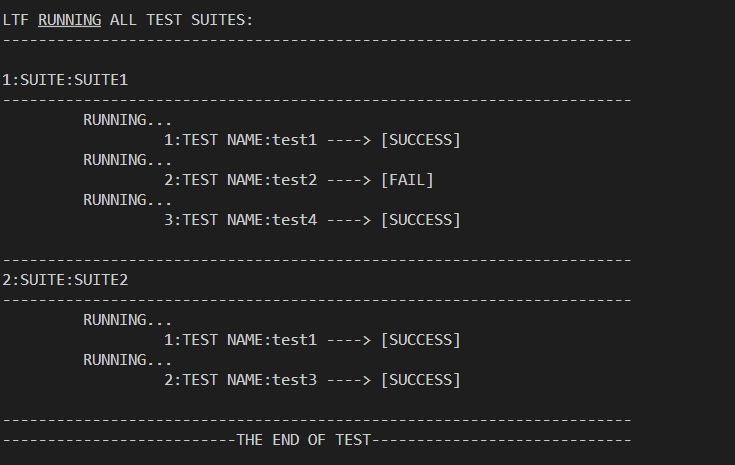
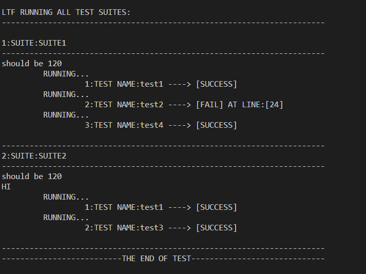

# Little Test Framework (LTF)
Little Test Framework(LTF), is a hassle-free C++ unit testing. Designed to make your testing experience efficient and effective, this framework provides a minimalistic approach while maintaining powerful testing capabilities.


## Operations
See the Usage for more comprehensive examples.
* Make Your Ttility Functions Like 
```
inline LTF::LTFStatus <your utility function name>(bool debug = false)
```
* Register Your Test Case Like
```
LTF_TEST(<Test Suite Name>, <Test Case Name>, <Related Utility Function>);
```
* Run All The Registered Tests By
```
// for debug flag
const bool debug = true;

int main()
{
    // Run All
    LTF::LTF_RUN_ALL(debug);
    return 0;
}
```


## Demo
- Debug == False

- Debug == True



## Features
- 🧪 Simplicity: We understand the importance of clean and straightforward testing. "Little Test Framework" lets you define and execute tests with just a few lines of code, without overwhelming you with unnecessary complexities.

- 🛠️ Macro-powered: Harness the power of macros to effortlessly define and manage your test cases. Using the LTF_TEST macro, you can easily create, organize, and run your tests, ensuring a smooth development process.

- 📜 Test Discovery: The framework automates test discovery, saving you time and effort. It automatically locates and runs all registered tests, providing a comprehensive overview of your code's health.

- 🚀 Efficient Execution: "Little Test Framework" optimizes the execution of your test suite, enabling rapid feedback loops during development. Spend less time waiting for tests to run and more time coding.

- 📊 Clear Reporting: With minimalistic design principles in mind, the framework provides concise and informative test execution reports. Identify issues quickly and make informed decisions based on test results.


## Installation Using CMake
```
cmake_minimum_required(VERSION 3.12)
project(YourProjectName) # Replace "YourProjectName" with the actual name of your project

# Set CMP0002 policy to NEW to suppress the warning
cmake_policy(SET CMP0002 NEW)

if(CMAKE_CXX_COMPILER_ID MATCHES GNU)
    set(CMAKE_CXX_FLAGS "${CMAKE_CXX_FLAGS} -fprofile-arcs -ftest-coverage")
endif()

## Fetch the content
include(FetchContent)
FetchContent_Declare(
  LTF
  GIT_REPOSITORY https://github.com/Serenity0204/Little-Test-Framework.git
)
FetchContent_MakeAvailable(LTF)

## Linking
ADD_EXECUTABLE(main main.cpp)
TARGET_LINK_LIBRARIES(main PRIVATE LTF)
```


## Usage
```
#include <LTF.h>
#include <iostream>
using namespace std;

unsigned long long factorial(int n)
{
    if (n == 0 || n == 1)
    {
        return 1;
    }
    else
    {
        return n * factorial(n - 1);
    }
}
// test utility functions implement your logic here
inline LTF::LTFStatus test_utils_main1(bool debug = false)
{
    return LTF::LTFStatus(LTF::SUCCESS, __LINE__);
}

inline LTF::LTFStatus test_utils_main2(bool debug = false)
{
    return LTF::LTFStatus(LTF::FAIL, __LINE__);
}

inline LTF::LTFStatus test_utils_main3(bool debug = false)
{
    if (debug)
    {
        cout << "HI" << endl;
    }
    int a = 1 + 1;
    if (a == 2) return LTF::LTFStatus(LTF::SUCCESS, __LINE__);
    return LTF::LTFStatus(LTF::FAIL, __LINE__);
}

inline LTF::LTFStatus test_utils_main4(bool debug = false)
{
    if (debug)
    {
        cout << "should be 120" << endl;
    }
    long long f = factorial(5);
    if (f != 120) return LTF::LTFStatus(LTF::SUCCESS, __LINE__);
    return LTF::LTFStatus(LTF::FAIL, __LINE__);
}


// test registration, format as (<Test Suite Name>, <Test Case Name>, <Test Case Utility Function>)
LTF_TEST(SUITE1, test1, test_utils_main1);

LTF_TEST(SUITE2, test3, test_utils_main3);

LTF_TEST(SUITE1, test2, test_utils_main2);

LTF_TEST(SUITE1, test4, test_utils_main4);

LTF_TEST(SUITE2, test1, test_utils_main4);

const bool debug = true;

int main()
{

    LTF::LTF_RUN_ALL(debug);
    return 0;
}
```


## Design
Can be found in https://github.com/Serenity0204/Little-Test-Framework/blob/master/design.txt


